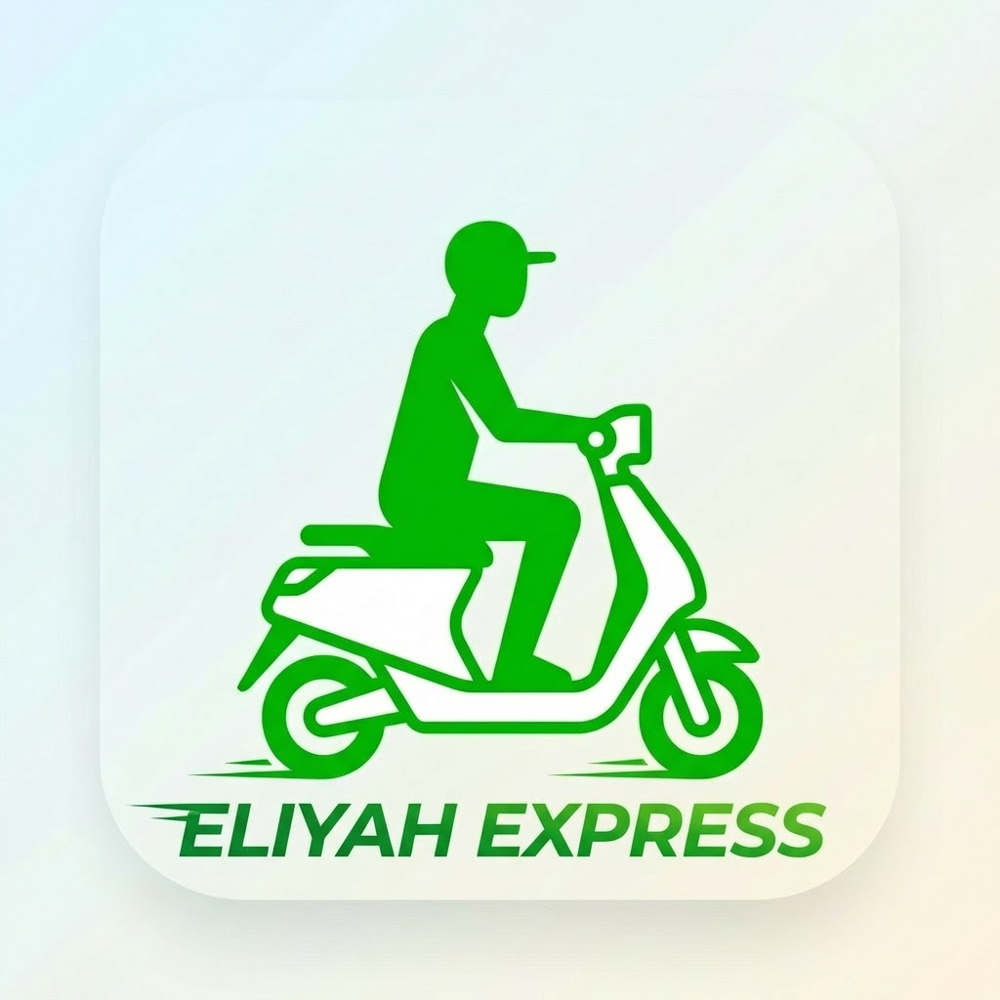

# 🚚 Eliyah Express

<div align="center">



**Application mobile de livraison pour les livreurs Eliyah-Express**

[](https://flutter.dev)
[](https://dart.dev)
[](https://firebase.google.com)
[](LICENSE)

[Fonctionnalités](#-fonctionnalités) • [Installation](#-installation) • [Configuration](#-configuration) • [Utilisation](#-utilisation) • [Support](#-support)

</div>

---

## 📱 À propos

**Eliyah-Express** est l'application mobile dédiée aux livreurs de la plateforme **Eliyah-Market**. Elle permet aux livreurs de gérer leurs livraisons en temps réel, de suivre leurs gains, et d'optimiser leurs trajets de livraison.

### 🎯 Objectif

Fournir aux livreurs un outil simple, rapide et efficace pour :
- Recevoir et accepter des commandes en temps réel
- Naviguer vers les points de collecte et de livraison
- Gérer leur statut (en ligne/hors ligne)
- Suivre leurs revenus et statistiques
- Communiquer avec les clients et les magasins

---

## ✨ Fonctionnalités

### 🔐 Authentification & Profil
- ✅ Connexion sécurisée avec numéro de téléphone (+226 par défaut)
- ✅ Inscription des nouveaux livreurs
- ✅ Gestion du profil (photo, informations personnelles)
- ✅ Réinitialisation du mot de passe
- ✅ Vérification OTP

### 📦 Gestion des Commandes
- ✅ Réception des nouvelles commandes en temps réel
- ✅ Acceptation/Refus des commandes
- ✅ Suivi du statut des commandes (en attente, acceptée, en cours, livrée)
- ✅ Historique complet des livraisons
- ✅ Détails des commandes (articles, prix, instructions)
- ✅ Preuve de livraison (photo)

### 🗺️ Navigation & Localisation
- ✅ Géolocalisation en temps réel
- ✅ Intégration Google Maps
- ✅ Itinéraire optimisé vers le magasin et le client
- ✅ Calcul automatique de la distance
- ✅ Suivi en direct de la position du livreur

### 💰 Gestion Financière
- ✅ Tableau de bord des gains
- ✅ Historique des transactions
- ✅ Gestion de l'argent en main (cash)
- ✅ Demandes de retrait
- ✅ Méthodes de paiement multiples
- ✅ Statistiques détaillées (jour, semaine, mois)

### 🔔 Notifications
- ✅ Notifications push pour les nouvelles commandes
- ✅ Alertes de statut de commande
- ✅ Notifications système
- ✅ Notifications en arrière-plan

### 💬 Communication
- ✅ Chat avec les clients
- ✅ Chat avec les magasins
- ✅ Appel téléphonique direct
- ✅ Historique des conversations

### 🌍 Multilingue
- ✅ Français (par défaut)
- ✅ Anglais
- ✅ Arabe
- ✅ Espagnol
- ✅ Bengali

### 🎨 Interface Utilisateur
- ✅ Design moderne et intuitif
- ✅ Mode sombre/clair
- ✅ Couleurs de marque Eliyah-Express
- ✅ Animations fluides
- ✅ Interface responsive

---

## 🛠️ Technologies Utilisées

### Framework & Langage
- **Flutter** 3.38.5 - Framework UI multiplateforme
- **Dart** 3.10+ - Langage de programmation

### Backend & Services
- **Firebase Core** - Infrastructure backend
- **Firebase Authentication** - Authentification sécurisée
- **Firebase Messaging** - Notifications push
- **API REST** - Communication avec le serveur Eliyah-Express

### Packages Principaux
| Package | Version | Utilisation |
|---------|---------|-------------|
| `get` | ^4.7.3 | Gestion d'état et navigation |
| `google_maps_flutter` | ^2.14.0 | Cartes et navigation |
| `geolocator` | ^14.0.2 | Géolocalisation |
| `geocoding` | ^4.0.0 | Conversion adresses/coordonnées |
| `firebase_messaging` | ^16.1.0 | Notifications push |
| `flutter_local_notifications` | ^19.5.0 | Notifications locales |
| `shared_preferences` | ^2.5.4 | Stockage local |
| `image_picker` | ^1.1.2 | Capture de photos |
| `url_launcher` | ^6.3.2 | Appels téléphoniques |
| `connectivity_plus` | ^7.0.0 | Vérification de la connectivité |

---

## 📥 Installation

### Prérequis

- **Flutter SDK** 3.38.5 ou supérieur
- **Dart SDK** 3.10 ou supérieur
- **Android Studio** / **Xcode** (pour le développement mobile)
- **Git**

### Étapes d'Installation

1. **Cloner le dépôt**
   ```bash
   git clone https://github.com/votre-organisation/eliyah-delivery.git
   cd eliyah-delivery
   ```

2. **Installer les dépendances**
   ```bash
   flutter pub get
   ```

3. **Configurer Firebase**
   - Placer `google-services.json` dans `android/app/`
   - Placer `GoogleService-Info.plist` dans `ios/Runner/`
   - Vérifier la configuration dans `lib/main.dart`

4. **Configurer l'API**
   - Mettre à jour l'URL de base dans `lib/util/app_constants.dart`
   ```dart
   static const String baseUrl = 'https://eliyah.aladints.com';
   ```

5. **Lancer l'application**
   ```bash
   # Android
   flutter run -d android
   
   # iOS
   flutter run -d ios
   
   # Web
   flutter run -d chrome
   ```

---

## ⚙️ Configuration

### Configuration Firebase

L'application utilise Firebase pour :
- Authentification
- Notifications push
- Analytics (optionnel)

**Fichiers de configuration :**
- `android/app/google-services.json`
- `ios/GoogleService-Info.plist`
- `web/index.html` (configuration Firebase Web)

### Configuration API

Modifier les constantes dans `lib/util/app_constants.dart` :

```dart
class AppConstants {
  static const String appName = 'Eliyah-Livreur';
  static const String baseUrl = 'https://eliyah.aladints.com';
  
  // Endpoints API
  static const String loginUri = '/api/v1/auth/delivery-man/login';
  static const String currentOrdersUri = '/api/v1/delivery-man/current-orders';
  // ...
}
```

### Configuration Google Maps

1. Obtenir une clé API Google Maps
2. Ajouter la clé dans :
   - `android/app/src/main/AndroidManifest.xml`
   - `ios/Runner/AppDelegate.swift`
   - `web/index.html`

---

## 🚀 Utilisation

### Connexion

1. Lancer l'application
2. Saisir votre numéro de téléphone (indicatif +226 par défaut)
3. Entrer votre mot de passe
4. Cliquer sur "Se connecter"

### Inscription (Nouveau Livreur)

1. Sur l'écran de connexion, cliquer sur "Rejoindre en tant que livreur"
2. Remplir le formulaire d'inscription :
   - Informations personnelles
   - Photo de profil
   - Pièce d'identité
   - Type de véhicule
   - Zone de livraison
3. Soumettre la demande
4. Attendre l'approbation de l'administrateur

### Gestion des Commandes

1. **Passer en ligne** : Activer le statut "En ligne" sur le tableau de bord
2. **Recevoir une commande** : Notification push + alerte dans l'app
3. **Accepter/Refuser** : Consulter les détails et décider
4. **Naviguer** : Utiliser la carte pour aller au magasin
5. **Récupérer** : Confirmer la récupération de la commande
6. **Livrer** : Naviguer vers le client et livrer
7. **Confirmer** : Prendre une photo et confirmer la livraison

### Gestion des Gains

1. Accéder à "Mes Gains" dans le menu
2. Consulter les statistiques (aujourd'hui, cette semaine, ce mois)
3. Voir l'historique des transactions
4. Demander un retrait si le solde est suffisant

---

## 📂 Structure du Projet

```
eliyah-delivery/
├── android/                 # Configuration Android
├── ios/                     # Configuration iOS
├── web/                     # Configuration Web
├── assets/                  # Ressources (images, langues)
│   ├── image/              # Images et icônes
│   └── language/           # Fichiers de traduction
│       ├── fr.json         # Français
│       ├── en.json         # Anglais
│       ├── ar.json         # Arabe
│       ├── es.json         # Espagnol
│       └── bn.json         # Bengali
├── lib/                     # Code source Dart
│   ├── common/             # Widgets et utilitaires communs
│   ├── features/           # Fonctionnalités par module
│   │   ├── auth/           # Authentification
│   │   ├── dashboard/      # Tableau de bord
│   │   ├── order/          # Gestion des commandes
│   │   ├── profile/        # Profil utilisateur
│   │   ├── wallet/         # Portefeuille
│   │   └── ...
│   ├── helper/             # Classes d'aide
│   ├── theme/              # Thèmes (clair/sombre)
│   ├── util/               # Constantes et utilitaires
│   └── main.dart           # Point d'entrée
├── pubspec.yaml            # Dépendances Flutter
└── README.md               # Ce fichier
```

---

## 🎨 Personnalisation

### Couleurs de la Marque

Les couleurs Eliyah-Express sont définies dans :
- `lib/theme/light_theme.dart`
- `lib/theme/dark_theme.dart`

```dart
// Couleurs principales
primaryColor: Color(0xFF2D7A3E),      // Vert foncé
secondaryColor: Color(0xFF8BC34A),    // Vert clair
```

### Logo et Icônes

- **Logo principal** : `assets/image/logo.png`
- **Icônes Android** : `android/app/src/main/res/mipmap-*/`
- **Icônes iOS** : `ios/Runner/Assets.xcassets/AppIcon.appiconset/`
- **Icônes Web** : `web/icons/`

---

## 🔧 Compilation

### Android (APK)

```bash
# Debug
flutter build apk --debug

# Release
flutter build apk --release

# Split APK par architecture
flutter build apk --split-per-abi
```

### Android (App Bundle)

```bash
flutter build appbundle --release
```

### iOS

```bash
# Debug
flutter build ios --debug

# Release
flutter build ios --release
```

### Web

```bash
flutter build web --release
```

---

## 🧪 Tests

```bash
# Lancer tous les tests
flutter test

# Tests avec couverture
flutter test --coverage

# Tests d'intégration
flutter drive --target=test_driver/app.dart
```

---

## 📝 Changelog

### Version 1.0.0 (Février 2026)
- ✅ Rebranding complet vers Eliyah-Express
- ✅ Localisation française par défaut
- ✅ Indicatif téléphonique +226 (Burkina Faso)
- ✅ Nouveau design avec couleurs de marque
- ✅ Optimisations de performance
- ✅ Corrections de bugs

---

## 🐛 Problèmes Connus

- **Notifications iOS** : Nécessite une configuration supplémentaire des certificats APNs
- **Google Maps Web** : Performances limitées sur les connexions lentes
- **Mode hors ligne** : Fonctionnalités limitées sans connexion Internet

---

## 🤝 Contribution

Ce projet est propriétaire. Pour toute contribution :

1. Contacter l'équipe de développement
2. Créer une branche de fonctionnalité
3. Soumettre une pull request
4. Attendre la revue de code

---

## 📞 Support

### Contact

- **Email** : support@eliyah-express.com
- **Téléphone** : +226 XX XX XX XX
- **Site Web** : https://eliyah-express.com

### Documentation

- [Guide de l'utilisateur](docs/user-guide.md)
- [Guide du développeur](docs/developer-guide.md)
- [API Documentation](docs/api-docs.md)

---

## 📄 Licence

Copyright © 2026 Eliyah-Express. Tous droits réservés.

Ce logiciel est propriétaire et confidentiel. Toute utilisation, reproduction ou distribution non autorisée est strictement interdite.

---

## 👥 Équipe

Développé avec ❤️ par l'équipe Eliyah-Express

---

<div align="center">

**Eliyah-Livreur** - Livrez avec efficacité 🚚

</div>
